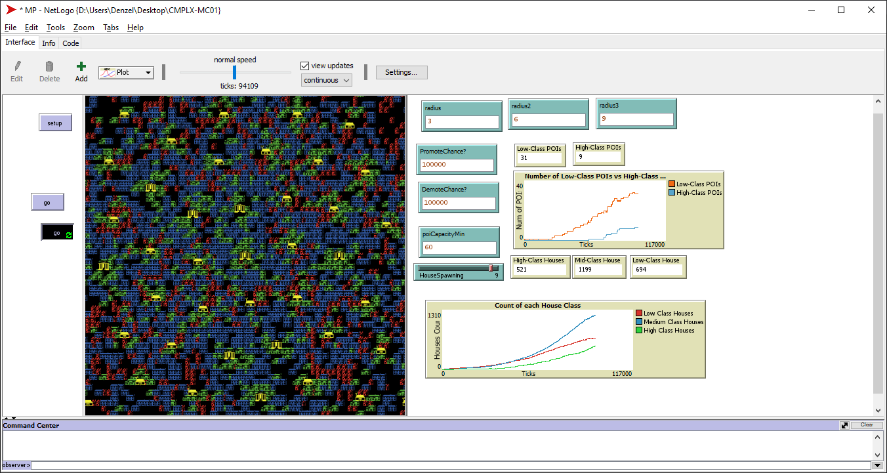

# CMPLX-MC01

## Installation
Before using the program, install the latest version of Netlogo [here](https://ccl.northwestern.edu/netlogo/).

## About
A simple house simulation that would create houses and Points Of Interest (POIs) with varying classes of wealth.
- Low Class
- Middle Class
- High Class

Intitally there would be a POI at the center of the grid, and houses would spawn around it at a certain range. Additionally, houses may promote or demote to wealthier or poorer houses. When this occurs, the house would also have to relocate to another space nearby a POI that matches its socio-economic status. After the number of maximum houses exceeded for existing POIs, a new POI would be created in a nearby space.  

POIs may also be upgraded to a high class POI when there are more high class houses compared to low class houses in its surrounding. When this happens, only middle and high class houses are allowed to be in its surrounding, while all low class houses are forced to relocate to another low class POI.

## Usage
Press `Setup` to initialize the environment and press `Go 🔁` to simulate the generation of houses and POIs. The sliders can be used to modify the variables of the program. These are:

| Variable | Description |
| -------- | ----------- |
| radius | Range of the high class houses spawning around the POI |
| radius2 | Range of the middle class houses spawning around the POI |
| radius3 | Range of the low class houses spawning around the POI |
| PromoteChance | Chance of the house upgrading into a higher class house where 1/X is the promotion chance |
| DemoteChance | Chance of the house downgrading into a lower class house where 1/X is the promotion chance |
| poiCapacityMin | Maximum threshold of houses per POI |
| HouseSpawning | Number of houses that spawn per tick |

Monitors are shown to see the number of houses and POIS, as well as the number of each wealth classes.  

## Images
